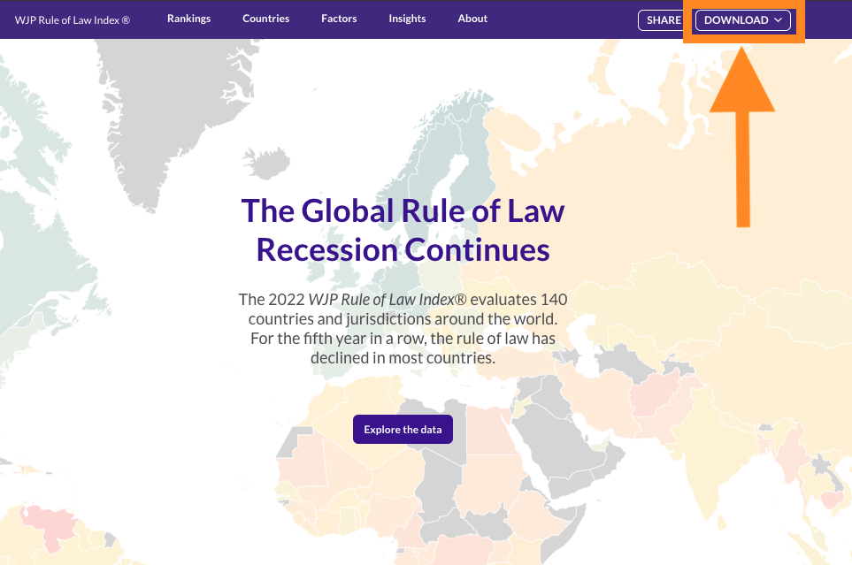
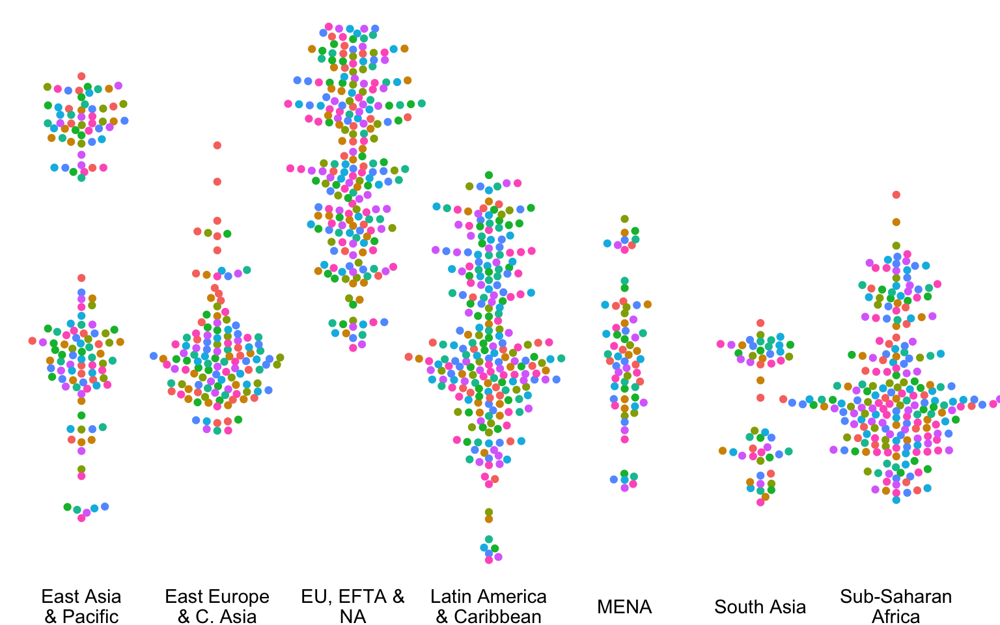
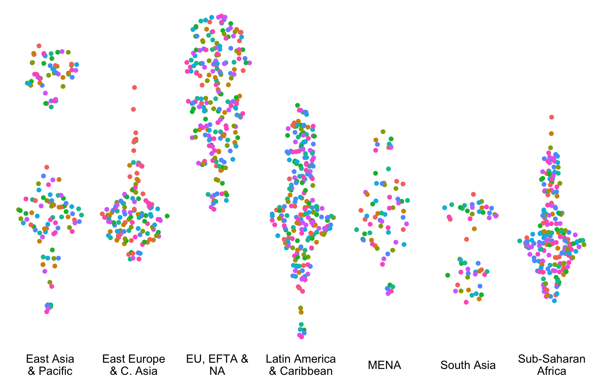
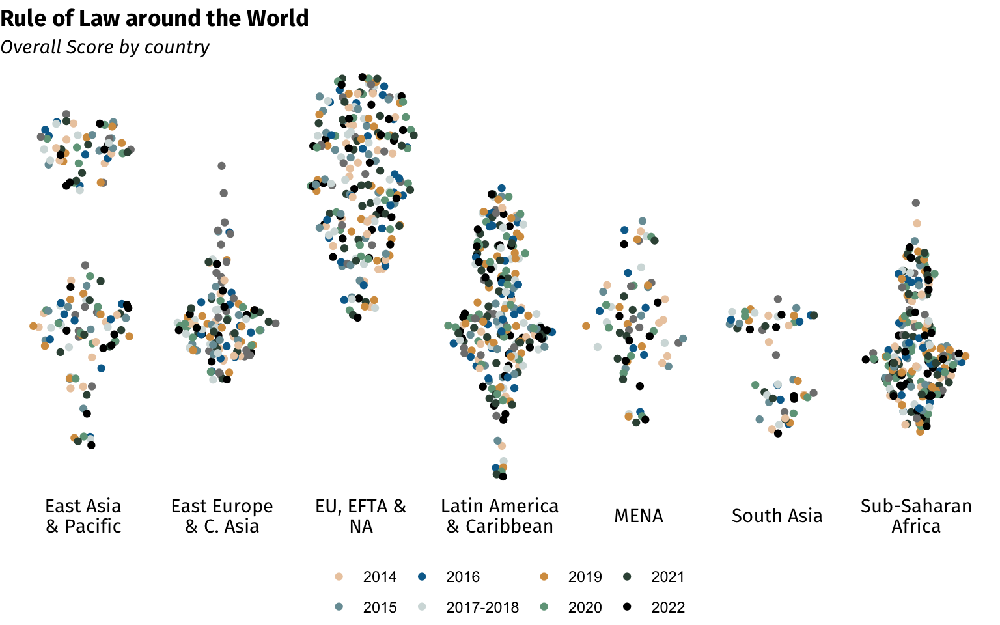
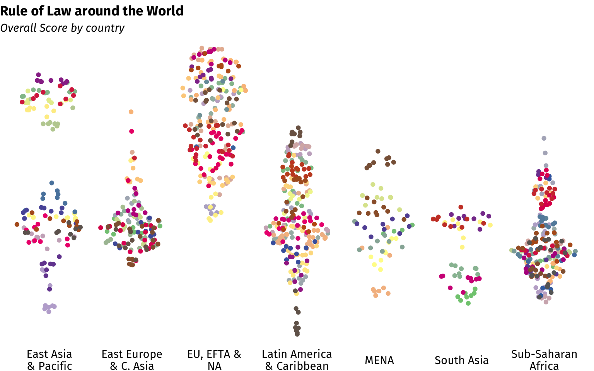

In this blog post I want to show you how to use bee swarm plots to show distributions of data points in a beautiful way. 

Usually, data distributions are shown with histograms, density, box and/or violin charts. Without a doubt, these usual alternatives are great options that deliver plenty of information. However, they fall into a complicated trade-off. Histograms and density plots are easy to understand for the general audience but they are not visually striking. On the other hand, violin and box plots can be visually striking but they require a certain level of understanding from the audience. If you are looking for a way to display the distribution of data in a very simple and visually striking way, I personally think that bee swarm plots can be very helpful.


## What are Bee Swarm Plots?

Bee swarms take the idea behind [Strip Plots](https://datavizproject.com/data-type/strip-plot/#:~:text=A%20strip%20plot%20is%20a,the%20same%20value%20can%20overlap.) by placing groups in the X-Axis and plotting their respective values of interest in the Y-Axis using data points. However, unlike strip charts, they apply a certain algorithm to avoid the overlapping of points. Depending of the algorithm, the data points can take various forms that resemble a bee swarm.

## How to make a Bee Swarm plot in R

For this exercise, we will be producing a bee swarm plot using the data from the ***Rule of Law Index*** published by the [The World Justice Project](https://worldjusticeproject.org/rule-of-law-index/). We begin by downloading the data and save it into our respective working or project directory:



Once that we have the data in our local machine. We begin our R session by loading our respective packages. In this exercise we will be using the Tidyverse collection of packages and the ggbeeswarm package:

1.  The good 'ol [Tidyverse](https://www.tidyverse.org/) (I know, that's more than one package, but you know what I mean).
2.  Given that the data is in an Excel sheet, I prefer to load it using the [readxl package](https://readxl.tidyverse.org/) from the Tidyverse. Given that this packages is not part of the core **Tidyverse** it has to be loaded separately.
3.  To do the bee swarms I will be using the [ggbeeswarm package](https://github.com/eclarke/ggbeeswarm), which is an extension of the ggplot package. I personally prefer to use this package over others out there because it allows you to plot the swarms as *geoms* inside your ggplot instead of producing a whole new object. This options which gives you a more control over the overall plot because you can use the traditional ggplot platform to modify the plot to your liking. However, if you want something quick and you don't mind having no customization over the final plot, you can also use the [beeswarm package](https://github.com/aroneklund/beeswarm).

You can install the ggbeeswarm package from [CRAN](https://cran.r-project.org/) or use the developer's version as follows:

```
install.packages("ggbeeswarm")
devtools::install_github("eclarke/ggbeeswarm")
```

```r
# Loading required libraries 
library(readxl) 
library(ggbeeswarm) 
library(tidyverse)
```

We can now read the data into our R session. But before doing that, we need to check the structure of the data in the excel sheet that we just downloaded. A quick inspection of the excel file gives us a few issues. First, the data is displayed in different sheets by year and they are not in a proper format to be work with. Nevertheless, the last sheet of the workbook is labelled "Historical Data" and it has a kind of better structure. Therefore, we proceed to load only this sheet into our R session.

```r
master_data.df <- read_excel("ROLI_data.xlsx",
                            sheet = "Historical data") %>%
  select(1:4, roli_score = 5) %>% # We just need the overall Rule of Law Index Score for this exercise
  mutate(Region = case_when(
    Region == "East Asia & Pacific"           ~ "East Asia\n& Pacific",
    Region == "Eastern Europe & Central Asia" ~ "East Europe\n& C. Asia",
    Region == "EU + EFTA + North America"     ~ "EU, EFTA &\nNA",
    Region == "Latin America & Caribbean"     ~ "Latin America\n& Caribbean",
    Region == "Middle East & North Africa"    ~ "MENA",
    Region == "Sub-Saharan Africa"            ~ "Sub-Saharan\nAfrica",
    TRUE ~ Region
  ))
```

We begin our ggplot by setting up the data and the general aesthetics:

```r
base <- ggplot(data = master_data.df,
               aes(x     = Region,
                   y     = roli_score,
                   color = Year,
                   text  = Country))
```

Once that we have set up the basics, we draw the bee swarms. This can be done by adding two types of geoms: 1) `geom_beeswarm` or 2) `geom_quasirandom`. The difference in these two geoms is the type of algorithm used to spread the data points. From a visual perspective, we can say that `geom_beeswarm` gives you a more simetric and ordered points while `geom_quasirandom` (yeah, you guess it) adds an almost random noice to the final position of the data points.

Each of these geoms have an argument called `method` that can also slightly modify the way the points are placed in the plot. You can review the functions documentation an experiment with the different methods available. For this exercise I will be using the *swarm (default)* method for the `geom_beeswarm` and the *pseudorandom* method for the `geom_quasirandom`.

```r
# Adding a beeswarm geom

plot <- base +
  geom_beeswarm(method = "swarm",
                cex    = 1.15,
                show.legend = F) +
  theme_void() + 
  theme(axis.text.x = element_text())

# How does the plot look?
plot
```



```r
# Adding an almost random noice
plot <- base +
  geom_quasirandom(method = "pseudorandom",
                   show.legend = F) +
  theme_void() + 
  theme(axis.text.x = element_text())

# How does the plot look?
plot
```



If you ask me, I prefer chaos. That's why I would definetely go with the pseudo random noice plot rather than with a more symmetric shape. Now, here is where the ggplot options are wonderful. Why? Because now, we can add some customization to our plot and, honestly, with ggplot, the sky is the limit.

```r
# Adding an almost random noice
plot <- base +
  geom_quasirandom(method = "pseudorandom") +
  scale_color_manual(values = c("2014"      = "#ECCBAE", #Desert Sand
                                "2015"      = "#789CA4", #Cadet Grey
                                "2016"      = "#046C9A", #Bice Blue
                                "2017-2018" = "#D3DDDC", #Platinum
                                "2019"      = "#D69C4E", #Earth Yellow
                                "2020"      = "#70A288", #Cambridge Blue
                                "2021"      = "#385144", #Feldgrau
                                "2022"      = "#000000") #Black
                     ) +
  labs(title    = "Rule of Law around the World",
       subtitle = "Overall Score by country") +
  theme_void() + 
  theme(legend.position = "bottom",
        plot.title      = element_text(family = "Fira Sans",
                                       face   = "bold"),
        plot.subtitle   = element_text(family = "Fira Sans",
                                       face   = "italic"), 
        axis.text.x     = element_text(family = "Fira Sans",
                                       face   = "plain"),
        legend.title    = element_blank(), 
        legend.margin   = margin(10,2,2,2))

# How does the plot look?
plot
```



Now that we have a more aesthetic plot, we can derive conclusions from its distribution. For example, due to its vertical spread, we can say East Asia & Pacific and Latin America and the Caribbean are the most unequal regions of the world in terms of Rule of Law in its countries. We can also appreciate that countries in the East Asia & Pacific can be clustered in two different groups, one with high levels of Rule of Law and another with medium to low levels. This pattern can also be seen in a lees dramatic way in South Asia and in the Middle East and North Africa region.

I choose a coloring system based on years in order to see if the distribution of the data points along the Y-Axis is being driven by time changes. The fact that the colors are quite diverse along the vertical axis of each region says the contrary. If we change the coloring to a country-based system, we will observe that the atypical high scores and the similarly atypical low scores displayed in the Middle East and North Africa region are each of them caused by a single country.

```r
library(RColorBrewer)

# Adding an almost random noice
plot_country <- ggplot(data = master_data.df,
                       aes(x     = Region,
                           y     = roli_score,
                           color = Country)) +
  geom_quasirandom(method = "pseudorandom") +
  labs(title    = "Rule of Law around the World",
       subtitle = "Overall Score by country") +
  scale_color_manual(values = colorRampPalette(brewer.pal(50, "Accent"))(length(unique(master_data.df$Country)))) +
  theme_void() + 
  theme(legend.position = "none",
        plot.title      = element_text(family = "Fira Sans",
                                       face   = "bold"),
        plot.subtitle   = element_text(family = "Fira Sans",
                                       face   = "italic"), 
        axis.text.x     = element_text(family = "Fira Sans",
                                       face   = "plain"),
        legend.title    = element_blank(), 
        legend.margin   = margin(10,2,2,2))

# How does the plot look?
plot_country
```



Having to choose the coloring system will be based in the kind of visualization and the conclusions that you want to deliver to your audience. However, if you are not restricted to static images, you can also just avoid this decision by transforming the chart into a dynamic plot. For that, we can make use of the [plotly package](https://plotly.com/r/) and the `ggplotly` function:

```r
library(plotly)
ggplotly(plot)
```


*The original post embeds an interactive chart here — omitted in this archive.*

Now, that we have a dynamic and interactive plot, we can observe that all the atypical high scores in the MENA region are coming from the United Arab Emirates, while all the atypical low scores are from Egypt.

You can further customize this new dynamic plot. However, this will be the topic of a future post. For now, here you have it, the beauty of bee swarm plots applied to real data. Have fun plotting some examples!!
