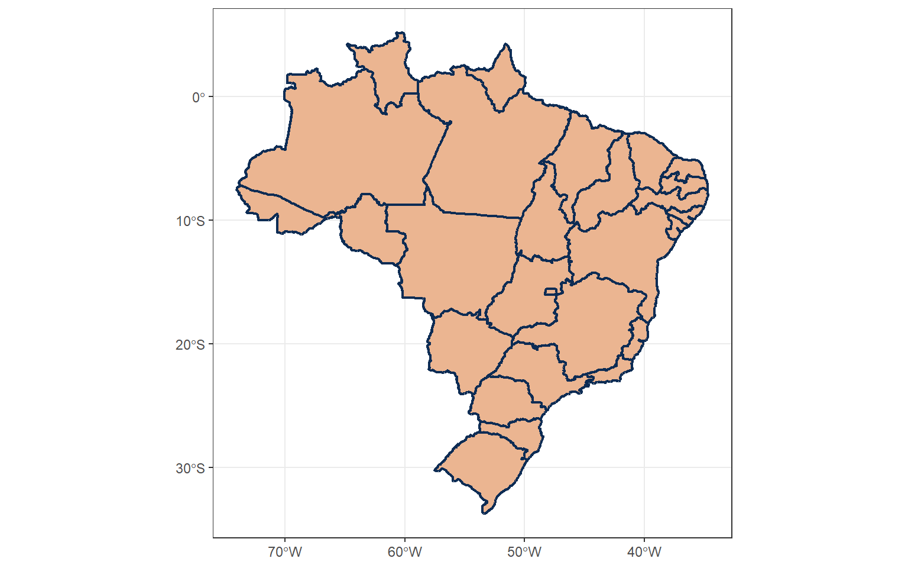
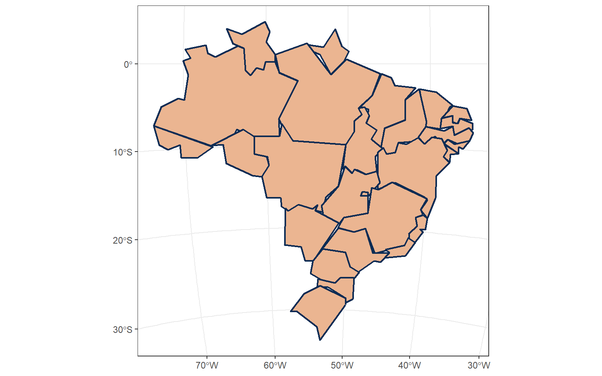
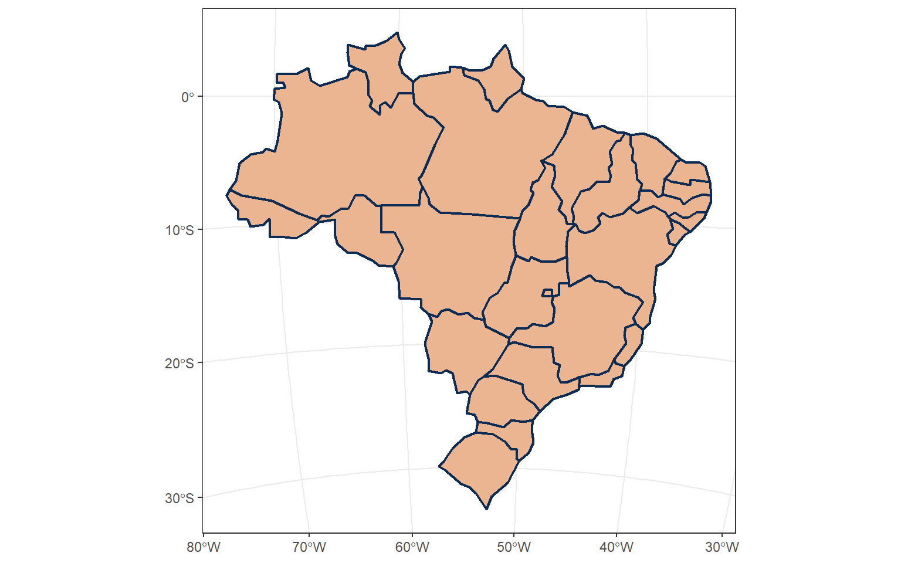

A few weeks ago, I had a very long email thread with some web developers. The main idea was to update our map boundaries on the web. So I sent them my beloved [international boundaries geoJSON file](https://github.com/ctoruno/ROLI-Map-App/blob/main/Data/data4app.geojson), which is a 22 MB file. Obviously, they were not so happy about receiving such a "*huge*" file (I have seen bigger). The thing is, when you are looking at dynamic maps on the web, they prefer to use not-so-detailed boundaries and go for "*smoother*" boundaries that will improve the loading times of the website. Therefore, they asked for a "*less precise*" version of the map.

To be honest, took me more time to process the request than to actually do what they were asking. You see, it sound so simple, right? But in my mind I had so many question. For example, how much is "*less precise*"? How many vertices should I preserve from the original? How much tolerance should I apply to the lines? Should I watch Home Alone or Love Actually for Christmas? To be honest, there is whole lesson behind a simple "*could you make it less precise*?". So, my dear three readers, I decided to write a blog post about what does making less precise maps means and how to do it in R.


## Geographical precision and Geometry Simplification

Let's start from the beginning.

When you have data on country boundaries, these boundaries are basically a huge collection of geographical coordinates that describes the borders of a specific country. Given that, most of the time, country borders are based on geographical features such as rivers and coastlines, describing the course of the border can become a very very very long set of geographical coordinates. Just imagine giving the precise latitude and longitude for every meter along the border. The data would be so huge that it would be not feasible to store or load with a laptop.

This is where the term **precision** comes into play. In Geographic Information Systems (GIS), precision refers to the level of detail or granularity in the representation of geographic data. For example, when you hear that a map has a precision of 50 meters, it means that the coordinates or locations are accurate in a radius of ... yes, you go it... 50 meters. For our previous example, this means that we do not have to follow the country border centimeter by centimeter, instead, we can just save the coordinates of two points and draw a straight line between them. If the new and much simpler line is always within 50 meters of the true border then we can treat it as the country border with a "*reduced*" level of precision.

The process of reducing the the complexity and level of detail of geographical data is what is called *Geometry Simplification*. In reality, the process is much more complex than just picking two random points. There are mathematical algorithms that help us in this. The two most used one are the [Douglas-Peucker algorithm](https://cartography-playground.gitlab.io/playgrounds/douglas-peucker-algorithm/) (DP) and the [Visvalingam--Whyatt algorithm](https://bost.ocks.org/mike/simplify/) (VW). For a nice comparison between these two algorithms, you can check [this post](https://martinfleischmann.net/line-simplification-algorithms/) by Martin Fleischmann.

For both methods, the user must input a ***tolerance*** parameter, or epsilon. This parameter represents either the maximum allowable distance between the original curve and the simplified line (DP) or it can also represent the minimum triangular area to be allowed for sets of points along the line (VW). Eitherway, selecting an adequate epsilon value is highly important and, to some extent, it is the art of optimization. On one hand, high precision might not be necessary or practical in certain applications. Therefore, simplified geometries can optimize the storage, analysis, and visualization of geographic data. On the other hand, over-simplification might compromise the integrity or usability of the data.

How much should you simplify? As always, it depends and I can't give you a proper answer just as the web developers couldn't give me one without realizing the kind of mental debate they were putting me into. But that's another story. What I CAN tell you, is how to implement this in R.

## Using the Geoboundaries API

We start by reading the boundaries data. In one of my [previous posts](https://www.carlos-toruno.com/blog/gis-exploding/) I mentioned that the [GeoBoundaries.org](https://www.geoboundaries.org/index.html) was one of my favorites places to go for national boundaries data. GeoBoundaries is a community-driven project that provides a comprehensive and open-source database of geospatial data for specific countries or the entire world. Their data is available in various formats such as ESRI shapefile, GeoJSON, or KML. However, one of my favorite resources is that you can access their data through an API. In this post, I will be using the GeoBoundaries data to show how to simplify geospatial features, but you also have other options available in the web such as [Natural Eart](https://www.naturalearthdata.com/downloads/), [GADM](https://gadm.org/), [TIGER](https://tigerweb.geo.census.gov/tigerwebmain/TIGERweb_main.html), among many others.

For this post, I will be working with Brazil's second level administrative boundaries (ADM-2). You can get general information on the available data by making a call to this endpoint:

```
https://www.geoboundaries.org/api/current/gbOpen/[3-LETTER-ISO-CODE]/[BOUNDARY-TYPE]/
```

where you just need to input the 3-letter ISO code for Brazil and set ADM-2 as the desired boundary type to retrieve. For this, we use the [httr2 package](https://httr2.r-lib.org/) as follows:

```r
library(httr2)

# Defining the endpoint with the respective ADM-2 boundary info for Brazil
info_endpoint <- "https://www.geoboundaries.org/api/current/gbOpen/BRA/ADM1/"

# Fetching information
data_info <- request(info_endpoint) |> 
  req_perform() |> 
  resp_body_json()

# What info do we have available
names(data_info)
```

```
 [1] "boundaryID"                "boundaryName"             
 [3] "boundaryISO"               "boundaryYearRepresented"  
 [5] "boundaryType"              "boundaryCanonical"        
 [7] "boundarySource"            "boundaryLicense"          
 [9] "licenseDetail"             "licenseSource"            
[11] "boundarySourceURL"         "sourceDataUpdateDate"     
[13] "buildDate"                 "Continent"                
[15] "UNSDG-region"              "UNSDG-subregion"          
[17] "worldBankIncomeGroup"      "admUnitCount"             
[19] "meanVertices"              "minVertices"              
[21] "maxVertices"               "meanPerimeterLengthKM"    
[23] "minPerimeterLengthKM"      "maxPerimeterLengthKM"     
[25] "meanAreaSqKM"              "minAreaSqKM"              
[27] "maxAreaSqKM"               "staticDownloadLink"       
[29] "gjDownloadURL"             "tjDownloadURL"            
[31] "imagePreview"              "simplifiedGeometryGeoJSON"
```

As we can observe, we have a lot of information available. You can take a look at the [GeoBoundaries API documentation](https://www.geoboundaries.org/api.html) to know what kind of information you are getting back. This time, we are interested in the `gjDownloadURL` field. This field contains the static download link for the geoJSON file we are interested. Let's take a look:

```r
geoJSON_url <- data_info[["gjDownloadURL"]]
geoJSON_url
```

```
[1] "https://github.com/wmgeolab/geoBoundaries/raw/9469f09/releaseData/gbOpen/BRA/ADM1/geoBoundaries-BRA-ADM1.geojson"
```

We can use the [geojsonsf package](https://github.com/SymbolixAU/geojsonsf) to download this file directly from the web and read it as a simple feature object from the [sf package](https://r-spatial.github.io/sf/). Remember that simple features are the building blocks of modern Geospatial Analysis with R. Once the data is successfully loaded as a simple feature, we can use the usual [ggplot tools](https://ggplot2.tidyverse.org/)to visualize the data:

```r
library(geojsonsf)
library(sf)
library(ggplot2)

# Reading the daa
BRA_boundaries <- geojson_sf(geoJSON_url)

# Visualizing the data
ggplot(BRA_boundaries) +
  geom_sf(fill = "#EBB591",
          colour = "#0D2C54",
          linewidth = 0.75) +
  theme_bw()
```



Beautiful. We were able to access the geographic data. Now, how do I simplify this?

## Geographic Coordinate Systems

As it happens, the `sf package` has a native function called `st_simplify` which can be used to simplify geometries using the Douglas-Peucker algorithm. However, remember, we need to specify an epsilon, which is the minimum allowed distance between the original curve and the resulting simplified line. So, let's go big an input 45 kilometers. Now, I know what 45 kilometers means, but my data (just as some of my american friends) will be left wondering like... what's a kilometer?

As it happens, geographical data is a representation of the earth and the earth is, kind of a sphere (if any of you is a flat-earther supporter... please stop reading this post... you have bigger problems going on - I'm looking at you BoB). Now, there are many ways of representing a sphere. Therefore, it is highly important that you ALWAYS check what kind of framework is your data using to represent locations on this beautiful pseudo-sphere that we call Earth. We can do this by calling the `sf::st_crs()` function.

```r
# Data Coordinate System
st_crs(BRA_boundaries)
```

```
Coordinate Reference System:
  User input: 4326 
  wkt:
GEOGCS["WGS 84",
      DATUM["WGS_1984",
        SPHEROID["WGS 84",6378137,298.257223563,
          AUTHORITY["EPSG","7030"]],
        AUTHORITY["EPSG","6326"]],
      PRIMEM["Greenwich",0,
        AUTHORITY["EPSG","8901"]],
      UNIT["degree",0.0174532925199433,
        AUTHORITY["EPSG","9122"]],
      AXIS["Latitude",NORTH],
      AXIS["Longitude",EAST],
    AUTHORITY["EPSG","4326"]]
```

As we can observe, the coordinate reference system of our data is the WGS 84, also known as the World Geodetic System 1984, and the **UNIT** for this system are degrees. I don't know about you, but I will need a pen, a map, and a calculator to convert kilometers to degrees.

Most geographic coordinate systems use degrees as their measurement units because they keep representing data on a sphere. What we can do is to switch to a projected coordinate system. Unlike geographic systems, map projections try to represent geographic data on a flat two dimensional plane. NO!! The earth is not flat!! It's just for humans to better understand where we are in a map (why are you still reading this BoB?). The advantage of projected maps is that, mos of them, use meters as their default measurement unit.

There are hundreds of projected coordinate systems out there. And I mean, hundreds. I won't go explaining them but you can watch this video to better understand what I'm talking about:

<YouTube id="NAzy4S4EOwc" />

You also have a less technical but shorter version here:

<YouTube id="eTYsIePy5zg" />

Anyway, given that we are working with Brazil geographic data, I choose a system that is optimized for working with Brazil locations such as the SIRGAS Brazil Polyconic 2000. Sounds like a very cool tech gadget, right? You can use the [EPSG online catalog](https://epsg.io/) for choosing a proper Coordinate System for your data.

We can transform our Brazil geographic data to the SIRGAS 2000 projected system using the `sf::st_transform()` function and the EPSG code 5880 as follows:

```r
# Transforming data to Brazil Polyconic Projection
BRA_boundaries_poly <- BRA_boundaries %>%
  st_transform(5880)

st_crs(BRA_boundaries_poly)
```

```
Coordinate Reference System:
  User input: EPSG:5880 
  wkt:
PROJCRS["SIRGAS 2000 / Brazil Polyconic",
    BASEGEOGCRS["SIRGAS 2000",
        DATUM["Sistema de Referencia Geocentrico para las AmericaS 2000",
            ELLIPSOID["GRS 1980",6378137,298.257222101,
                LENGTHUNIT["metre",1]]],
        PRIMEM["Greenwich",0,
            ANGLEUNIT["degree",0.0174532925199433]],
        ID["EPSG",4674]],
    CONVERSION["Brazil Polyconic",
        METHOD["American Polyconic",
            ID["EPSG",9818]],
        PARAMETER["Latitude of natural origin",0,
            ANGLEUNIT["degree",0.0174532925199433],
            ID["EPSG",8801]],
        PARAMETER["Longitude of natural origin",-54,
            ANGLEUNIT["degree",0.0174532925199433],
            ID["EPSG",8802]],
        PARAMETER["False easting",5000000,
            LENGTHUNIT["metre",1],
            ID["EPSG",8806]],
        PARAMETER["False northing",10000000,
            LENGTHUNIT["metre",1],
            ID["EPSG",8807]]],
    CS[Cartesian,2],
        AXIS["easting (X)",east,
            ORDER[1],
            LENGTHUNIT["metre",1]],
        AXIS["northing (Y)",north,
            ORDER[2],
            LENGTHUNIT["metre",1]],
    USAGE[
        SCOPE["Topographic mapping (small scale)."],
        AREA["Brazil - onshore and offshore. Includes Rocas, Fernando de Noronha archipelago, Trindade, Ihlas Martim Vaz and Sao Pedro e Sao Paulo."],
        BBOX[-35.71,-74.01,7.04,-25.28]],
    ID["EPSG",5880]]
```

As we can observe, our new data uses "meters" as the default measurement unit for lenght. Now, we can use the the native `st_simplify()` function by inputing 45,000 meters as our desired tolerance parameter.

```r
# Simplying geometries
BRA_simpl <- st_simplify(BRA_boundaries_poly,
                         preserveTopology = TRUE, 
                         dTolerance = 45000)

# Visualizing new features
ggplot(BRA_simpl) +
  geom_sf(fill = "#EBB591",
          colour = "#0D2C54",
          linewidth = 0.75) +
  theme_bw()
```



Our data for Brazil now looks much simpler. However, we are facing a problem. The `st_simplify()` method will apply the DP algorithm and preserve the topology of **individual** features within the data, in our example, each feature is a Federal State boundary. By preserving topology, I mean keeping the spatial relationships and properties of the data. The `st_simplify()` implementation of the DP algorithm is not able to preserve the topology of the **overall** data (feature collection). As a consequence, we end up observing gaps between the states. Not bueno.

Thankfully, there is a web-based tool called [Mapshaper](https://mapshaper.org/) which can help you implement a simplification algorithm and preserve the topology of the whole feature collection. However, mapshaper uses a different approach. Instead of requiring an **epsilon** value, it requires a **proportion** value. In other words, instead of requiring a tolerance parameter, it is asking you for a percentage of points (or vertices) that you wish to preserve from the original file. It will select the level of tolerance based on this percentage.

The mapshaper tools are originally written in Javascript. Nonetheless, we can thank [Andy Teucher](https://github.com/ateucher) for writing down [a wrapper](https://github.com/ateucher/rmapshaper) to implement them in R. You can install the `rmapshaper` library by running the following line in your RStudio console:

```r
install.packages("rmapshaper")
```

Once installed, we can use the `ms_simplify()` function to implement the Visvalingam-Whyatt algorithm. I will ask the function to preserve only 0.5% of the original vertices:

```r
library(rmapshaper)

# Simplying geometries
BRA_simpl_mshap <- ms_simplify(BRA_boundaries_poly,
                               keep = 0.005,
                               keep_shapes = FALSE)

# Visualizing new features
ggplot(BRA_simpl_mshap) +
  geom_sf(fill = "#EBB591",
          colour = "#0D2C54",
          linewidth = 0.75) +
  theme_bw()
```



As we can observe, the state boundaries have been simplified and we do not have topology issues between individual features. And that's how you implement simplification algorithms in R. You are welcome.
